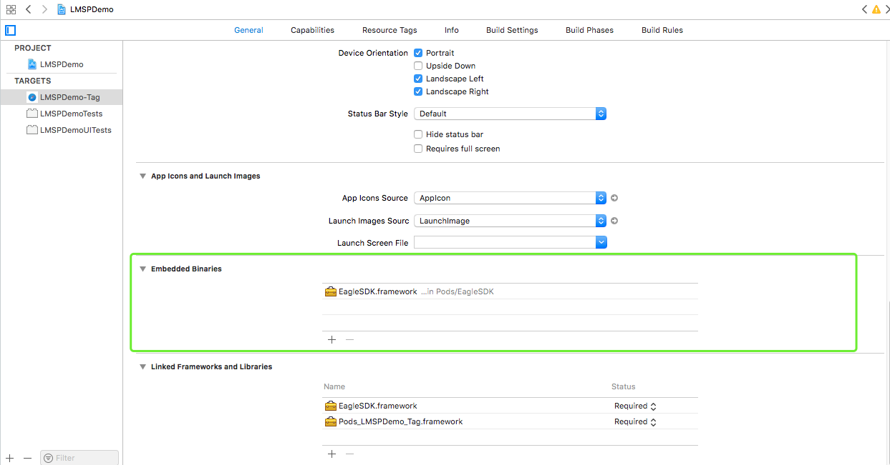
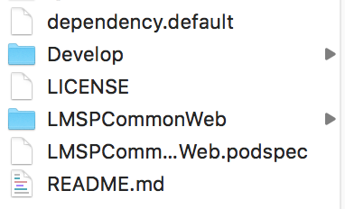
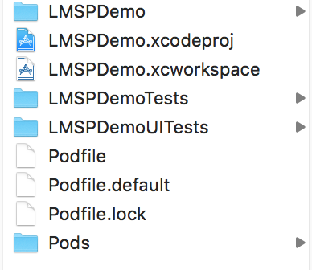
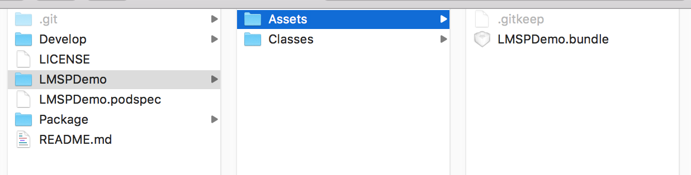

# 快速开始

EagleSDK是以动态库的形式打包成framework提供使用。需要搭配平台创建的应用工程一起使用。以EagleSDK为依赖开发的其他模块都以静态库的形式发布到私有repo。


## 快速集成

### 自动集成
* cocoapod集成

修改podfile(平台创建的脚手架工程不再需要该步骤)：

```ruby
 # <--添加私有repo-->
 source 'ssh://git@192.168.2.94:10022/repertory/cocoapods/Specs.git'
 source 'https://github.com/CocoaPods/Specs.git'
 platform :ios, '8.0'
 use_frameworks!
 
 # <--修改静态库校验和关闭BitCode-->
 pre_install do |installer|
     # workaround for #3289
     Pod::Installer::Xcode::TargetValidator.send(:define_method, :verify_no_static_framework_transitive_dependencies) {}
 end
 post_install do |installer|
     installer.pods_project.targets.each do |target|
         target.build_configurations.each do |config|
             config.build_settings['EXPANDED_CODE_SIGN_IDENTITY'] = ""
             config.build_settings['CODE_SIGNING_REQUIRED'] = "NO"
             config.build_settings['CODE_SIGNING_ALLOWED'] = "NO"
             config.build_settings['ENABLE_BITCODE'] = "NO"
         end
     end
 end
 
 # <--添加平台脚手架-->
 def importDefault
     arr_temp = IO.readlines('./Podfile.default').fetch(0).split("~")
     arr_temp.each do |i|
         if !(i.chomp.empty?)
             arr = i.split('@')
             if arr.size == 1
                 pod arr.fetch(0).chomp
             elsif arr.size == 2
                 pod arr.fetch(0), arr.fetch(1).chomp
             elsif arr.size == 3
                 pod arr.fetch(0), arr.fetch(1), arr.fetch(2).chomp
             end
         end
     end
 end
 
 target 'LMSPDemo-Tag' do
 
     # Pods Podfile.default
     importDefault
     #<--添加其他依赖-->
     pod 'Bugly'
     pod 'SVProgressHUD'
     pod 'IQKeyboardManager'
     pod 'SVGKit', :git => 'https://github.com/SVGKit/SVGKit.git', :branch => '2.x'
     pod 'EagleSDK'
     target 'LMSPDemoTests' do
         inherit! :search_paths
         # Pods for testing
     end
     target 'LMSPDemoUITests' do
         inherit! :search_paths
         # Pods for testing
     end
 end

```


## 工程配置

### 添加动态库




## 项目工程化

* <h3>模块工程</h3>


*1、dependency.default 系统依赖文件*  
*2、 Develop为静态库开发Demo工程*  
*3、 LMSPCommonWeb为静态库文件夹*  
*4、 LMSPCommonWeb.podspec为静态库的pod配置文件*  


* <h3> 应用工程</h3>


*这是常规使用Cocoapods管理依赖的工程目录*  
*1、Podfile.default为平台配置的系统依赖*

* <h3> 图标库工程</h3>

图标库工程是基于模块工程开发，目录与模块工程目录相同，


在静态库文件夹中的Assets资源文件夹中的bundle包中是iconfont的相关文件。


